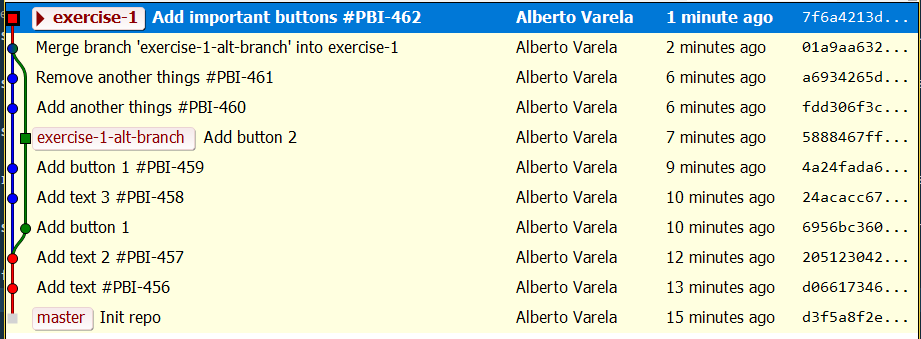
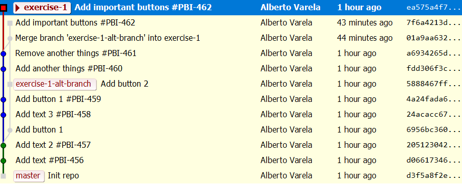

# Git advanced exercises

Real live situations that I resolved converted into exercises.

## Exercise 1

### Initial Scenario

- You are in a project that only has a main branch (`exercise-1`) and where you have a merge policy that forbids three-way merges, and enforces a single commit for each User Story.
- You were developing the `Add important buttons #PBI-462` User Story in a branch called `exercise-1-alt-branch` and you **forgot about the project merge policy**. Because of that reason, you ended up making a merge into the main branch. Not only that, you also forgot to squash your commmits and finally you got this situation:

### Exercise instructions

- Now you should push your changes but, in order to follow the project's merge policy, you need to fix your commits first:
    - The following commits (which are related to your User Story) should be squashed into a single commit with the following message: `Add important buttons #PBI-462`
        - `Add button 1 (6956bc360)`
        - `Add button 2 (5888467ffd)`
        - `Add important buttons #PBI-462 (7f6a4213dd)`
    - The previous squashed commit should be on top of the `exercise-1` branch, merged as fast-forward and not with a three-way strategy.

### Involved Branches in the exercise

- [exercise-1](https://github.com/artberri/git-exercises/tree/exercise-1): This branch will act as the exercise main branch.
- [exercise-1-alt-branch](https://github.com/artberri/git-exercises/tree/exercise-1-alt-branch): This branch has commits that we will need to include in main branch (see exercise).

### Final Situation

In order to finsh the exercise you should have the following tree:

The last commit (in blue) is the sum of our previously squashed commits.
